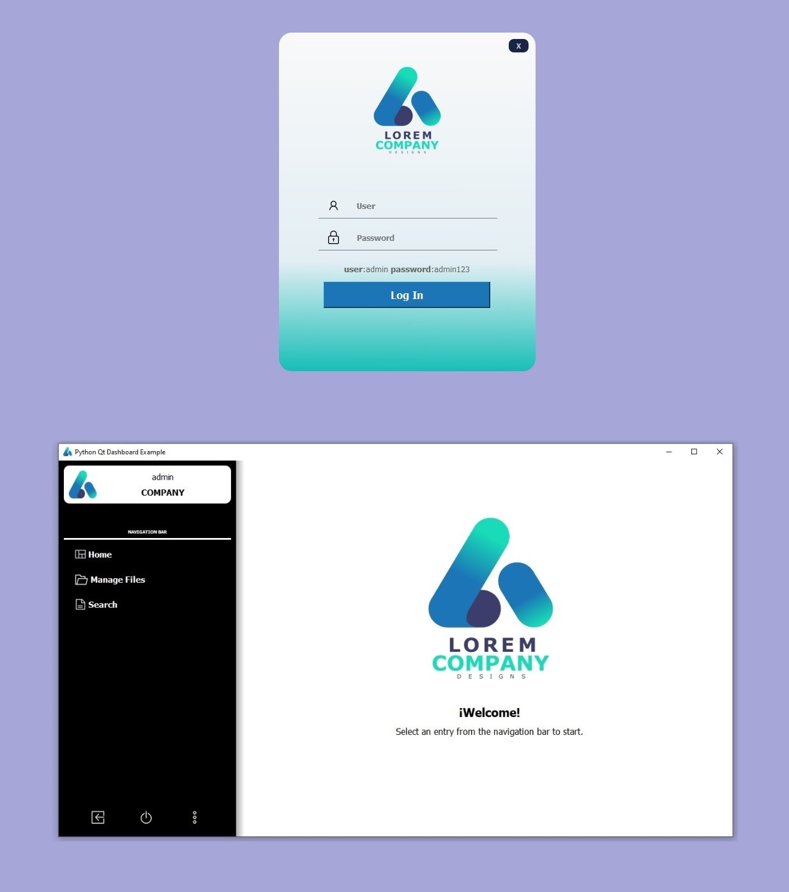
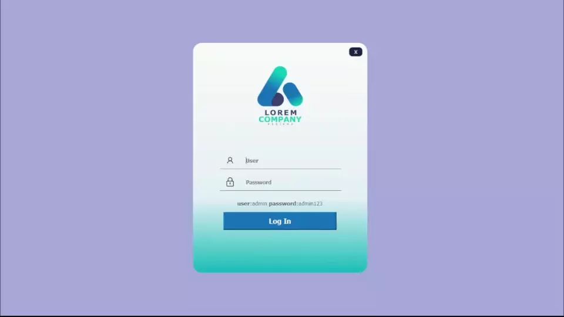

# Python Qt Dashboard

A GUI Login - Dashboard example using Python and Qt.

<p align="center">
      
</p>

### Build with:

[](https://www.python.org/)
[](https://www.qt.io/qt-for-python)

## Run Locally

Clone the project

```bash
  git clone https://github.com/ruveloper/python-qt-dashboard.git
```

Go to the project directory

```bash
  cd ./python-qt-dashboard
```

Create a python virtualenv and install requirements

```bash
  python -m venv .venv
  (windows) .\.venv\Scripts\activate
  pip install -r .\requirements.txt
```

Run project

```bash
  python main.py
```

<p align="center">
    
</p>

## License

[MIT](https://choosealicense.com/licenses/mit/)

